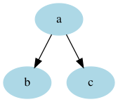
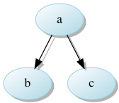
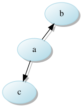

# Graphviz magic

Simple magic functions that adds support for dropping shadows in diagram

## Install

pip install git+https://github.com/sursingh/dotmagic.git

This has a dependency on [inkscape](https://inkscape.org/). `inkscape`
needs to be installed for supporting rendering to `png`. SVG rendering should
work out of the box.

## Usage

```
%%dot -prsK <layout>
 -p: convert image to png (default SVG)
 -r: return raw svg file
 -s: drop shadows
 -K <layout>: Select the layout
    dot(default), neato, twopi, circle, fdpm sfdp

%dotstr -prsK <layout> <dotstr>

```

Also it will expand the local variables

### Simple graph


```python
# Load the magic
%load_ext dotmagic

style='filled'
color='lightblue'
```


```python
%%dot
digraph {
    node [color="${color}" style="${style}"]
    a -> {b c}
}
```





```python
g = '''digraph {
   node [color="${color}" style="${style}"]
    a -> {b c} 
}'''
%dotstr g
```


### Adding a shadow


```python
%%dot -s
digraph {
    node [color="${color}" style="${style}"]
    a -> {b c}
}
```





### Change the layout


```python
%%dot -sK neato
digraph {
    node [color="${color}" style="${style}"]
    a -> {b c}
}
```




